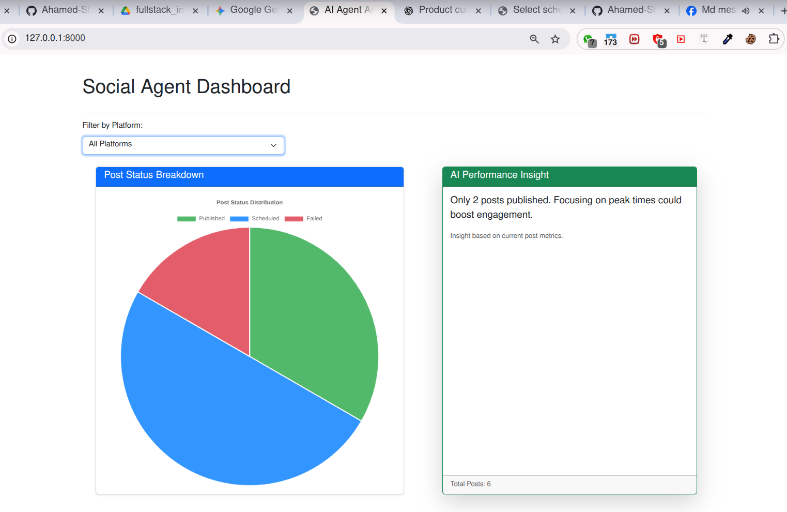

# AI-Agent-with-Social-Posting-Scheduling 

## Task-1 & 3 : Social Media Posting Agent + Analytics Dashboard
Django + DRF reference solution for the challenge: a lightweight AI-enabled scheduler that accepts text + image, target platforms (mock), scheduled time, stores everything in SQLite, uses APScheduler with a persistent jobstore to auto-publish, and exposes listing/status APIs
This project is a Django application for scheduling social media posts with an AI-powered analytics dashboard.

-----

### 1. Features

* **Scheduled Posting:** Schedule posts for Facebook, Twitter, and LinkedIn.
* **Celery Task Queue:** Handles background post publishing.
* **AI-Powered Insights:** Generates simple insights based on post performance.
* **Analytics Dashboard:** A frontend to visualize post status and AI insights.
* **RESTful API:** Manages posts and provides data for the dashboard.

-----

### 2. Technologies Used

* **Backend:** Python 3.10+, Django 5.2, Django REST Framework, Celery, Redis
* **Frontend:** Bootstrap 5, Chart.js, HTML, CSS, JavaScript
* **Database:** SQLite3

-----

### 3. Getting Started (Linux)

#### Prerequisites

* Python 3.10+
* pip (Python package installer)
* Redis server

You can install Redis on most Linux distributions using your package manager:

```bash
sudo apt-get update
sudo apt-get install redis-server
or
sudo apt-get install redis
```

#### Installation

1. **Clone the repository:**
   ```bash
   git clone https://github.com/Ahamed-Shojib/AI-Agent-with-Social-Posting-Scheduling.git
   cd AI-Agent-with-Social-Posting-Scheduling
   ```
2. **Create and activate a virtual environment:**
   ```bash
   python3 -m venv venv
   source venv/bin/activate
   ```
3. **Install dependencies:**
   ```bash
   pip install -r requirements.txt
   ```
4. **Set up the database and run migrations:**
   ```bash
   python manage.py migrate
   ```

#### Running the Project

You'll need **three separate terminal windows** to run all components simultaneously.

1. **Terminal 1: Start the Django development server:**
   ```bash
   python manage.py runserver
   ```
2. **Terminal 2: Start the Celery worker:**
   ```bash
   celery -A social_scheduler worker --loglevel=info
   ```
3. **Terminal 3: Start the Celery beat scheduler:**
   ```bash
   celery -A social_scheduler beat --loglevel=info
   ```
4. **Terminal 4: Start the Redis server:**
   ```bash
   redis-server --port 6380
   ```
-----

The application will be accessible at `http://127.0.0.1:8000/`. The dashboard will be at `http://127.0.0.1:8000/`.

-----

-----

### 5. Project Modules

* **`social_scheduler/`**: The main Django project directory.
* **`posting_agent/`**: The core Django app with models, views, and business logic.
* **`tasks.py`**: Contains **Celery tasks** for background post publishing.
* **`ai_utils.py`**: Utility for **AI-related functions**.
* **`dashboard.html`**: The frontend file for the **analytics dashboard**.

-----

### 6. API Endpoints

* **`POST /api/posts/`**: Create a new scheduled post.
* **`GET /api/posts/`**: List all scheduled posts.
* **`GET /api/dashboard/stats/`**: Get post statistics. Accepts an optional `platform` query parameter (e.g., `?platform=Facebook`).
* **`GET /api/dashboard/insight/`**: Get AI-generated insights. Accepts an optional `platform` query parameter (e.g., `?platform=Twitter`).

-----

-----

# Task-2: Product Customizer Web Application

This is a simple yet powerful web application built with **Django** and **vanilla JavaScript** that allows users to customize a product (T-shirt) by adding text overlays.

Users can preview their text live on the product, save their designs to the database, and view the most recent community creations.

---

## Features

- **Live Preview** – Instantly see your text displayed on a T-shirt image as you type.  
- **Save Customizations** – Seamlessly save your design with a single click.  
- **View Recent Designs** – The homepage shows the five most recent customizations.  
- **Responsive UI** – Clean, mobile-friendly interface powered by **Bootstrap 5**.  
- **RESTful Backend** – Django API endpoint handles all design persistence.  

---

## Tech Stack

- **Backend:** Django, Python  
- **Database:** SQLite (default Django DB)  
- **Frontend:** HTML, CSS, JavaScript (vanilla)  
- **Styling:** Bootstrap 5  

-----

The application will be accessible at `http://127.0.0.1:8000/task2`.

-----

-----
